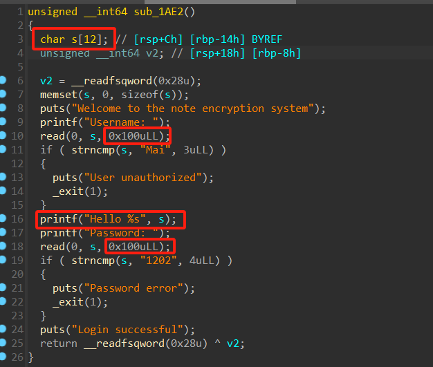
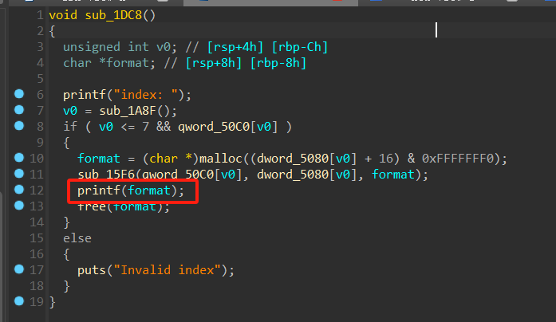
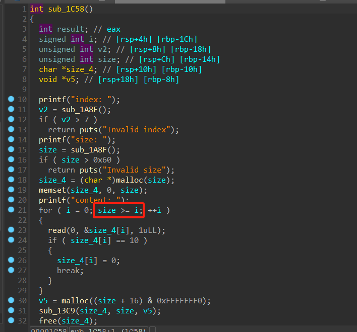
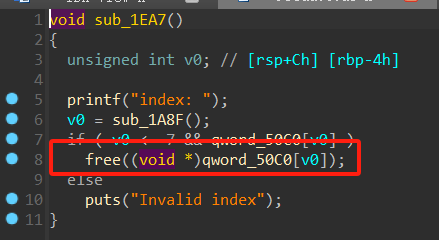

# Encrypted Note WP

## 0x01 栈溢出

在输入用户名与密码时，绕过 `strncmp` 后可以栈溢出，`printf("Hello %s", s);` 可以数据连带泄露地址和canary，第一次用来泄露canary然后部分写返回地址再次返回到这个函数；第二次用来泄露libc相关地址之后构造ropchain泄露flag和key求得原flag

## 0x02 格式化字符串

第二个功能中展示笔记内容时存在格式化字符串漏洞，先泄露stack和libc相关地址，后续利用栈上二级指针通过 `%n`格式化在栈中写入加密后flag与AES的key的地址将它们泄露出来求得原flag

## 0x03 堆溢出（off by one）

在读入笔记内容时存在 `off by one` 漏洞造成单字节堆溢出，利用这个漏洞修改下一个堆块的size之后造成堆叠，后用堆叠连带泄露出heap相关地址，伪造出 `unsorted chunk` 后继续利用数据连带泄露libc相关地址（AES加密后的密文0x10字节对齐，所以只要密文后面紧跟着未被加密的下一个笔记的内容就可以泄露地址）。最后利用堆叠在写入笔记内容时劫持tache的fd为`__free_hook`，将其修改为可以栈迁移的 `gadget` 后构造ropchain泄露flag和key求得原flag

## 0x03 UAF（double free）

堆块在 `free` 后指针未清空造成UAF漏洞，利用这个漏洞可以double free堆块，因为tache上的fd指针指向的是堆块用户数据的地址（比fastbins中的fd高0x10），所以可以造成堆块错位后进行堆块的越界读写。注意到如果申请的笔记的大小是0的话，则不会进行加密（循环次数为0次），利用这个可以保证申请出来的笔记密文上的数据不被加密后的数据覆盖（保留了该堆块在bins中的fd，即下一个堆块的地址），通过展示笔记内容时的数据连带即可泄露heap相关地址。然后再利用错位的堆块（即小范围的堆叠）越界修改下一个堆块的大小伪造出 `unsorted chunk` 泄露libc相关地址。最后和 `off by one` 漏洞一样，利用堆叠在写入笔记内容时劫持tache的fd为`__free_hook`，将其修改为可以栈迁移的 `gadget` 后构造ropchain泄露flag和key求得原flag
